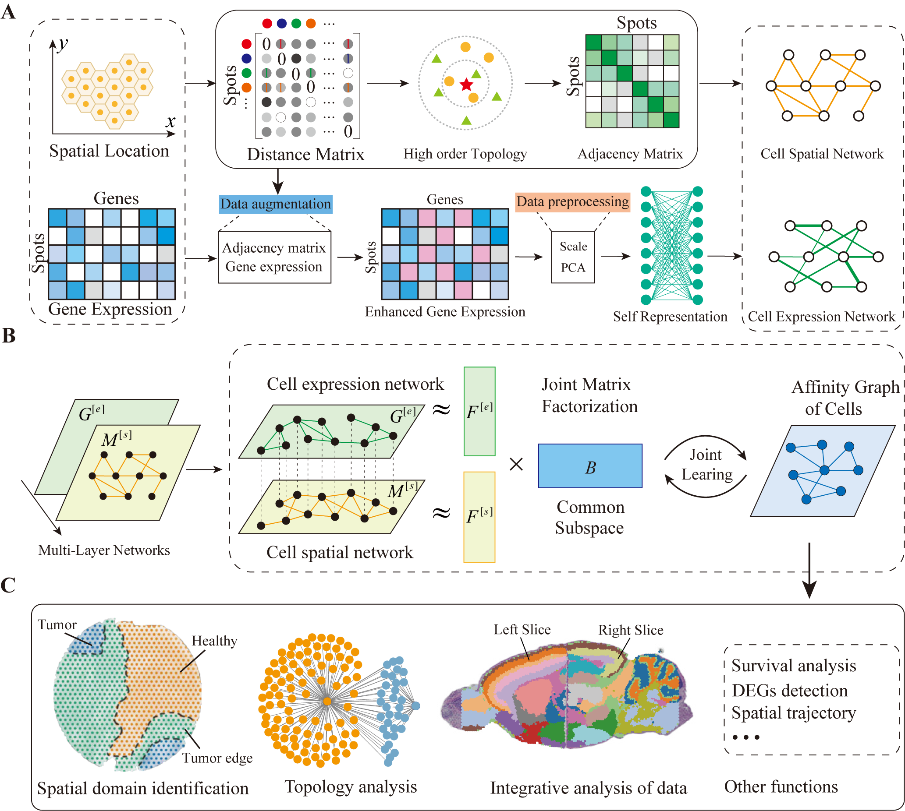

# MNMST v1.0

## Multi-Layer Network Model leverages identification of spatial domains from spatial transcriptomics data

###  Yu Wang, Zaiyi Liu, Xiaoke Ma

MNMST is a multi-layer network model to characterize and identify spatial domains in spatial transcriptomics data by integrating gene expression and spatial location information of cells. MNMST jointly decomposes multi-layer networks to learn discriminative features of cells, and identifies spatial domains by exploiting topological structure of affinity graph of cells. The proposed multi-layer network model not only outperforms state-of-the-art baselines on benchmarking datasets, but also precisely dissect cancer-related spatial domains. Furthermore, we also find that structure of spatial domains can be precisely characterized with topology of affinity graph of cells, proving the superiority of network-based models for spatial transcriptomics data. Moreover, MNMST provides an effective and efficient strategy for integrative analysis of spatial transcriptomic data, and also is applicable for processing spatial omics data of various platforms. In all, MNMST is a desirable tool for analyzing spatial transcriptomics data to facilitate the understanding of complex tissues.

A jupyter Notebook of the tutorial is accessible from : 
 
https://github.com/xkmaxidian/MNMST/blob/main/tutorials_mnmst.ipynb

 

The DLPFC 151675 and 151676 dataset are contained in 'Data' folder.

Please install **jupyter notebook** in order to open this notebook.

##### The coding here is a generalization of the algorithm given in the paper. MNMST is written in Python and MATLAB programming language. To use, please clone this repository and follow the instructions provided in the README.md.

Files:

MNMST.m - The main function of MNMST.

run_MNMST.m - A script with a real spatial transcriptomcs data to show how to run the code.

Data/151675: Sample DLPFC 151675 dataset.
